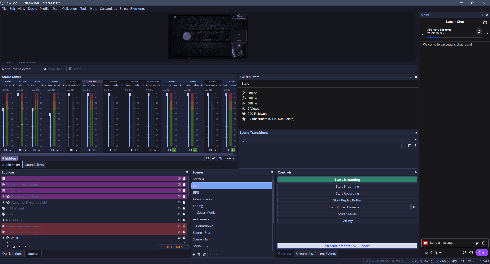

# OBS Studio Tokyo Night Theme

A **Tokyo Night color theme for OBS Studio**, based on the **Yami Default** theme.

## Why I made this

I wanted a proper **Tokyo Night** theme for OBS Studio, but I couldn't find one that matched what I was looking for.

So I decided to make my own.

This theme was created with the help of AI and is designed to keep the original Yami Default appearance while replacing its color palette with the **Tokyo Night** color scheme.

It has been tested on recent versions of OBS Studio and is designed to work with the newer OBS theme system, where some older custom themes may no longer work correctly.

## Installation

### Windows

1. Download the theme files from this repository.
2. Open your OBS Studio themes folder:

```text
C:\Program Files\obs-studio\data\obs-studio\themes\
```

3. Drag and drop the downloaded theme files into the `themes` folder.
4. If Windows asks whether you want to replace existing files, confirm it.
5. Restart OBS Studio.

> If your OBS Studio installation is located somewhere else, open your OBS installation directory and navigate to `data\obs-studio\themes\`.

### Enable Tokyo Night

Once the files are installed:

1. Open **OBS Studio**.
2. Go to **Settings → Appearance**.
3. Select **Yami Default** as the theme.
4. Select **Tokyo Night** as the theme variant.
5. Click **Apply** or **OK**.

That's it. Your OBS Studio interface should now use the Tokyo Night color palette.

## Preview



## Credits

* **Yami Default**: Original OBS Studio theme developed by [Warchamp7](https://github.com/Warchamp7).
* **Tokyo Night**: Color palette and design inspiration from the [Tokyo Night project](https://github.com/tokyo-night).
* This OBS Studio theme was created with AI assistance.

## Notes

This project is a color customization of the existing Yami Default theme. It does not aim to replace the original OBS Studio theme.

If you encounter any issues or have suggestions for improvements, feel free to open an issue on this repository.
